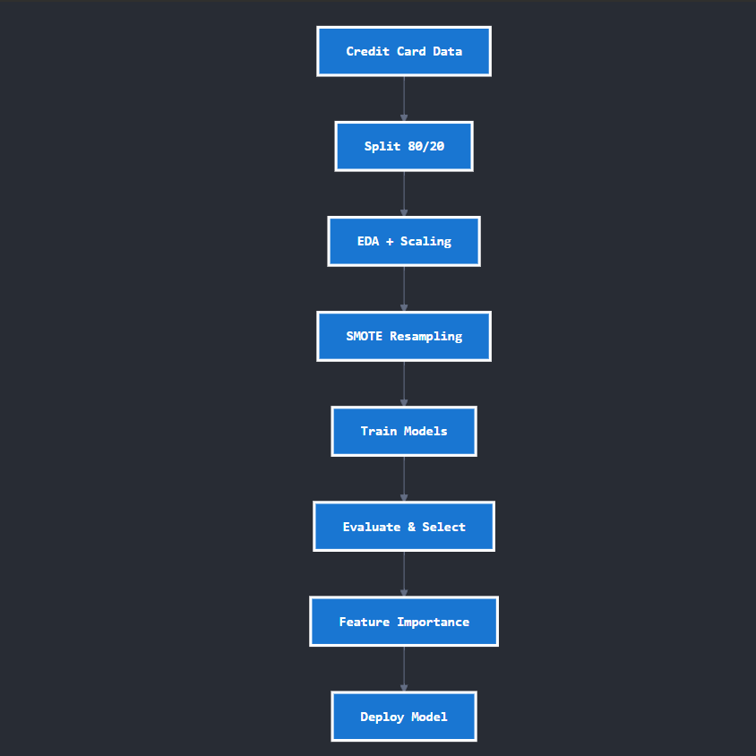
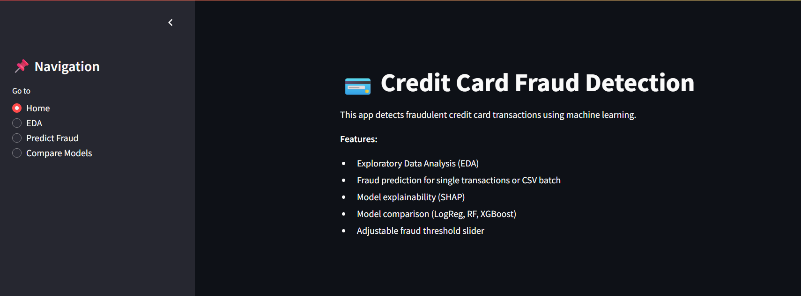
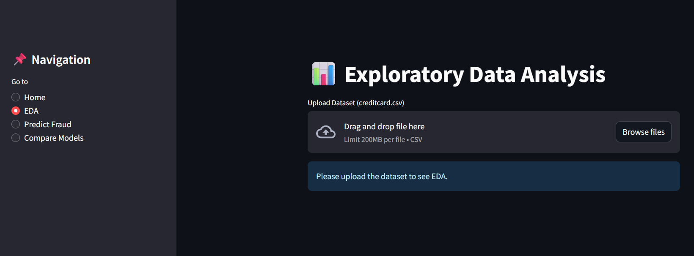
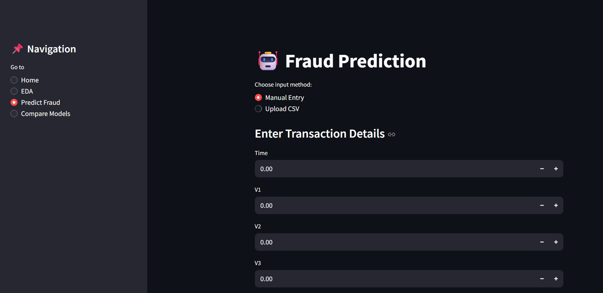
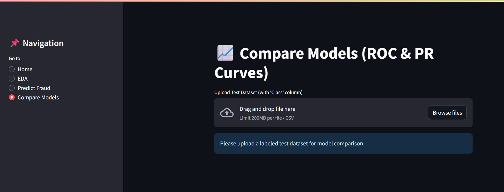

# 💳 Credit Card Fraud Detection

## 📌 Project Overview
Credit card fraud is a critical financial crime that leads to significant losses for banks and consumers.  
This project focuses on building an **end-to-end fraud detection pipeline** using **Machine Learning**  techniques.  

The solution includes:
- **Exploratory Data Analysis (EDA)** to understand fraud patterns  
- **Data preprocessing & feature engineering**  
- **Handling extreme class imbalance** using **SMOTE** and **SMOTEENN**  
- **Training multiple models (Logistic Regression, Random Forest, XGBoost)**  
- **Hyperparameter tuning** for optimized performance  
- **Explainability (SHAP)** to interpret model predictions  
- **Streamlit Web App** for real-time fraud prediction  

---

## 📂 Dataset Description
- **Source**: [Kaggle - Credit Card Fraud Detection](https://www.kaggle.com/mlg-ulb/creditcardfraud)  
- **Size**: 284,807 transactions  
- **Features**: 30 (28 PCA-anonymized features + `Time` + `Amount`)  
- **Target**: `Class` → 0 (Non-Fraud), 1 (Fraud)  
- **Imbalance**: Only ~0.17% of transactions are fraudulent  

> ⚠️ Note: Dataset is not included in this repository due to GitHub file size limits.  
Please download it from Kaggle and place it in a `data/` folder before running the code.

---

## ⚙️ Methodology

### Flow Diagram


Steps:
1. **Data Splitting** → Train (80%) + Test (20%)  
2. **EDA** → Visualization of class imbalance, transaction amount & time distributions  
3. **Feature Engineering** → Scaling `Time` & `Amount`  
4. **Resampling** → Apply **SMOTE / SMOTEENN** to balance data  
5. **Model Training** → Logistic Regression, Random Forest, XGBoost  
6. **Evaluation** → ROC-AUC, PR-AUC, Precision, Recall, F1  
7. **Explainability** → Feature importance & SHAP plots  
8. **Deployment** → Streamlit app for predictions  

---

1. **Data Splitting**  
   - Train (80%) + Test (20%) split  
   - Test set stored separately (`creditcard_test.csv`) for unbiased evaluation  

2. **Exploratory Data Analysis (EDA)**  
   - Class distribution (Fraud vs Non-Fraud)  
   - Transaction amount & time patterns  
   - Correlation heatmap  
   - PCA feature distributions  

3. **Feature Engineering**  
   - Standardization of `Time` and `Amount`  
   - Resampling strategies: **SMOTE** and **SMOTEENN**  

4. **Model Training & Hyperparameter Tuning**  
   - Models: Logistic Regression, Random Forest, XGBoost  
   - Used `RandomizedSearchCV` for RF/XGB optimization  

5. **Evaluation**  
   - ROC-AUC  
   - Precision-Recall AUC  
   - Classification report (Precision, Recall, F1)  
   - Feature importance (RF, XGB)  
   - Explainability with SHAP  

---

## 🤖 Models Implemented
- **Logistic Regression** (baseline)  
- **Random Forest Classifier** (tree ensemble)  
- **XGBoost Classifier** (gradient boosting)  

---

## 📊 Results

### SMOTE (Synthetic Minority Oversampling)
| Model               | ROC-AUC | PR-AUC | Precision (Fraud) | Recall (Fraud) | F1-Score (Fraud) |
|---------------------|---------|--------|-------------------|----------------|------------------|
| Logistic Regression | 0.9686  | 0.681  | 0.05              | 0.87           | 0.10             |
| Random Forest       | **0.9769** | 0.786  | 0.68              | 0.82           | 0.75             |
| XGBoost             | 0.9690  | **0.806** | 0.23              | 0.89           | 0.36             |

### SMOTEENN (Hybrid Over/Under Sampling)
| Model               | ROC-AUC | PR-AUC | Precision (Fraud) | Recall (Fraud) | F1-Score (Fraud) |
|---------------------|---------|--------|-------------------|----------------|------------------|
| Logistic Regression | 0.9659  | 0.764  | 0.05              | 0.87           | 0.10             |
| Random Forest       | **0.9752** | 0.780  | 0.66              | 0.81           | 0.73             |
| XGBoost             | 0.9698  | **0.804** | 0.19              | 0.89           | 0.32             |

---

## 📈 Evaluation Metrics
- **ROC-AUC (Receiver Operating Characteristic)** → Measures ability to separate fraud vs non-fraud  
- **PR-AUC (Precision-Recall AUC)** → Better suited for imbalanced data  
- **Precision** → How many predicted frauds are actual frauds  
- **Recall (Sensitivity)** → How many actual frauds were detected  
- **F1-Score** → Balance between Precision and Recall  

---
## 🖥️ Streamlit Application

Built an interactive **Streamlit dashboard** to:  
✅ Upload transactions and check fraud probability  
✅ Compare models on ROC/PR curves  
✅ Visualize EDA  

### Screenshots:

| Fraud Detection Home Page | EDA Visualization |
|----------------------|------------------|
|  |  |

| Check Fraud Probability | Compare Models |
|--------------------|----------------------|
|  |  |

---

## 🛠️ Technologies Used
- **Python** (NumPy, Pandas, Matplotlib, Seaborn)  
- **Scikit-learn** (ML models, metrics, preprocessing)  
- **Imbalanced-learn** (SMOTE, SMOTEENN)  
- **XGBoost** (boosting algorithm)  
- **SHAP** (explainability)  
- **Streamlit** (web interface)  

---

## 📌 How to Run
1. Clone repo:
   ```bash
   git clone https://github.com/shivaprogrammer/Creditcard_Fraud_Detection.git
   cd Creditcard_Fraud_Detection

## 🚀 Live Demo
You can try the app here: [Streamlit App](https://creditcardfrauddetection-pvb7zetxmc6vuzvxxgkk5v.streamlit.app/)
